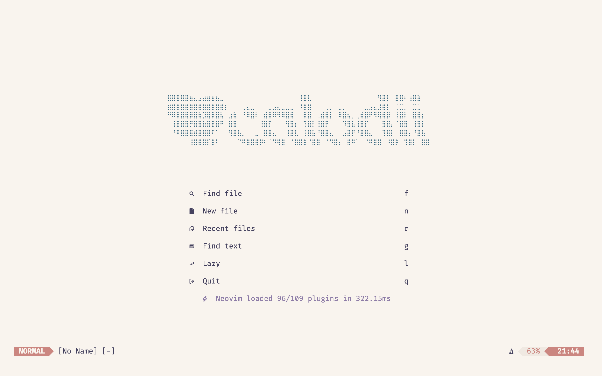

# Neovim Configuration - Complete Development Environment

A comprehensive, organized, and feature-rich Neovim configuration designed for productivity and development across multiple languages and frameworks.

Before you begin, please ensure you have the latest version of Neovim installed. This configuration is designed to work with Neovim 0.9.0 and above. 
Also it's very easy, and common, to be a 'vimpostor' and easily drown in configurations and not get actual work done. From experience, work with what you need, and add more as you go,
or even better, use this configuration as a starting point and reverse engineer it to understand how it works.

A few things to consider: I constantly update functions, and add new features, so not everything might work as expected, especially when a plugin 
is no longer being suppoerted. My preferred GNU terminal is Alacritty and the GUI of my choice is Neovide. Both are great, but you can use whatever you
want but for the love of God, almighty, please do not use ChatGPT to generate your configuration without understading it. Understand how it works, then use AI 
to automate the boring parts. Without further ado, here is a prety **** configuration. Up to you what **** means.

## Why This Configuration?
When I was in finance and marketing I used SQL and Python for data analysis mostly through the Jupyter Environment, then when I pivoted to engineering I realized how little I knew about how a computer
actually works, and how to use a terminal. Hence my journey to the world of NeoVim began. I have always enjoyed music production and even though my hearing loss tried to get in the way, here I am, 
developing audio applications. Think of me as the Vim Beethoven, but with a keyboard instead of a piano.

I started using ChadVim, but I had no idea how vim actully worked, and I was just copying and pasting configurations without understanding them. My job required me to work with audio develpment, and 
embedded systems, and going back and forth between my NeoVim configuration and the documentation was a pain. I just used the good old VSCode, turns out using an IDE was not ideal for me give the fact
that I had a potato of a laptop (not anymore - thank you capitalism), and I needed something lightweight, fast, and easy to use. This configuration has everything I use on a daily basis, from a neat 
dashboard, to LSP support, to Arduino development, and LaTeX integration. It is designed to be extensible, so you can easily add or remove features as needed.

One of my favorite features is my DIY theme switcher, which allows me to change the theme on the fly. People often laugh at me for being excited for the theme switcher, but trust me, it comes in handy
when it's 3:25am on a Tuesday, and you live in a studio apartment with your girlfriend (hopefully she says yes to the ring situation), and you need to change the theme from light to dark, or whatever the 
trillions of themes out there.

So yes - enjoy this powerful, feature-rich NeoVim configuration optimized for audio development, Python, Arduino, and LaTeX, with a focus on productivity and extensibility blah, blah, blah. 
Take into consideration that this will not make you a better engineer, we all still suck at electromagnetism, and we all still have impostor syndrome, but at least you will have a nice looking NeoVim
configuration. 



## Configuration Structure

```
~/.config/nvim/
├── init.lua                  # Main entry point (concise loader)
├── README.md                 # This comprehensive documentation
├── lazy-lock.json            # Plugin version lock file
├── 
├── lua/
│   ├── plugins.lua           # Plugin definitions
│   │
│   ├── config/               # ORGANIZED CONFIGURATION
│   │   ├── init.lua          # Configuration coordinator
│   │   ├── core.lua          # Core Neovim settings
│   │   ├── keymaps.lua       # All keybindings (organized by category)
│   │   ├── themes.lua        # 120+ themes with persistence
│   │   ├── ui.lua            # UI configuration (Neovide, explorer)
│   │   ├── commands.lua      # Custom commands (:DSP, :Maps, etc.)
│   │   └── lazy.lua          # Plugin manager setup
│   │
│   ├── calanuzao/            # Legacy modules (preserved)
│   │   ├── compat.lua        # Compatibility layer
│   │   ├── dsp.lua           # DSP formulas reference
│   │   ├── globals.lua       # Global utilities
│   │   ├── options.lua       # Vim options
│   │   └── remaps.lua        # Key remappings
│   │
│   └── plugins/              # Individual plugin configurations
│       ├── lsp.lua           # Language server setup
│       ├── telescope.lua     # Fuzzy finder
│       ├── harpoon.lua       # Quick navigation
│       ├── obsidian.lua      # Note-taking
│       ├── tmux.lua          # Terminal multiplexer
│       ├── neoclip.lua       # Clipboard manager
│       ├── nvim-ufo.lua      # Code folding
│       ├── VimTeX.lua        # LaTeX support
│       └── [others...]       # Additional plugins
│
├── ftplugin/                 # Filetype-specific settings
│   ├── java.lua              # Java-specific configuration
│   ├── cpp.lua               # C++ development setup
│   ├── c.lua                 # C development setup
│   ├── h.lua                 # C/C++ headers
│   ├── python.lua            # Python development setup
│   ├── matlab.lua            # MATLAB development setup
│   └── m.lua                 # MATLAB .m files
│
├── UltiSnips/                # Code snippets
│   └── tex.snippets          # LaTeX snippets
│
├── demos/                    # Development environment demos
│   ├── README.md             # Comprehensive demo documentation
│   ├── run_demo.sh           # Interactive demo selector
│   ├── python_demo_setup.sh  # Python development demo
│   ├── cpp_demo_setup.sh     # C++ development demo
│   └── matlab_demo_setup.sh  # MATLAB development demo
│
└── bookmarks/                # Saved locations and references
```

## Essential Commands

### **Configuration Commands**
```vim
:Maps                 " Show comprehensive keybindings cheat sheet
:DSP                  " Display DSP formulas and reference
:Specs                " Toggle Neovide performance profiler
:Atheme [theme]       " Switch themes (120+ available)
:Atheme               " List all available themes
```

### **Theme Management**
```vim
:Atheme rose-pine     " Switch to Rose Pine theme
:Atheme catppuccin    " Switch to Catppuccin theme
:Atheme gruvbox       " Switch to Gruvbox theme
:Atheme              " Show all 120+ available themes
```

### **Search & Navigation**
```vim
<leader>ff           " Find files (Telescope)
<leader>fg           " Live grep search
<leader>fb           " Find buffers
<leader>fh           " Find help tags
<leader>fr           " Find recent files
```

### **File Operations**
```vim
<C-n>                " Toggle file explorer
<C-j>                " Next tab
<C-k>                " Previous tab
<leader>e            " Focus file explorer
```

### **Testing & Development**
```vim
<leader>t            " Run tests
<leader>tf           " Run test file
<leader>tn           " Run nearest test
<leader>tl           " Run last test
```

### **Arduino Development**
```vim
<leader>av           " Verify Arduino code
<leader>au           " Upload Arduino code
:ArduinoVerify       " Verify current Arduino sketch
:ArduinoUpload       " Upload to connected board
```

### **C++ Development**
```vim
" LSP Features (automatically available in .cpp, .c, .h files)
gd                   " Go to definition
gD                   " Go to declaration
gr                   " Find references
gi                   " Go to implementation
K                    " Show hover documentation
<leader>rn           " Rename symbol
<leader>ca           " Code actions
<leader>f            " Format code

" C++ Specific
<leader>ch           " Switch between header/source
<leader>cs           " Show symbol info
<leader>ct           " Show type hierarchy

" Build & Run Commands
:CppCompile          " Compile current file
:CppRun              " Run compiled executable
:CppCompileRun       " Compile and run

" Header-specific (.h files)
:HeaderGuard         " Insert header guard
:ClassTemplate       " Insert class template
```

### **Python Development**
```vim
" LSP Features (Pyright + Ruff, automatically available in .py files)
gd                   " Go to definition
gD                   " Go to declaration
gr                   " Find references
K                    " Show hover documentation
<leader>rn           " Rename symbol
<leader>ca           " Code actions
<leader>f            " Format code (Ruff)

" Python Specific
<leader>pi           " Organize imports
<leader>pr           " Set Python path
<leader>pd           " Insert pdb breakpoint
<leader>pp           " Insert pprint statement

" Python Commands
:PyRun               " Run current Python file
:PyRunAsync          " Run in terminal
:PyTest              " Run pytest on file
:PyTestAll           " Run all tests
:PyFormat            " Format with Black
:PyLint              " Run pylint
:PyProfile           " Profile with cProfile
:PyVenv              " Activate virtual environment
:PyJupyter           " Start Jupyter notebook
```

### 📊 **MATLAB Development**
```vim
" MATLAB Section Navigation
]]                   " Next section (next %%)
[[                   " Previous section (previous %%)

" MATLAB Execution
<leader>mr           " Run MATLAB file
<leader>ms           " Run current section
<leader>md           " Debug MATLAB file
<leader>ml           " Lint with Code Analyzer
<leader>mp           " Profile MATLAB file

" MATLAB Documentation
<leader>mh           " Help for word under cursor
<leader>mD           " Documentation for word under cursor

" MATLAB Development
<leader>mf           " Insert function template
<leader>mb           " Insert breakpoint (keyboard)
<leader>mp           " Insert disp() statement
<leader>mP           " Quick plot command

" MATLAB Commands
:MatlabRun           " Run current file
:MatlabRunSection    " Run current section
:MatlabDebug         " Debug current file
:MatlabLint          " Run Code Analyzer
:MatlabProfile       " Profile current file
:MatlabFunction      " Insert function template
:MatlabToggleFunction" Toggle script/function mode

" Template Shortcuts (in insert mode)
for<Tab>             " For loop template
if<Tab>              " If statement template  
while<Tab>           " While loop template
try<Tab>             " Try-catch template
```

### 📚 **Note-Taking (Obsidian)**
```vim
<leader>oo           " Open Obsidian vault
<leader>on           " Create new note
<leader>of           " Find notes
<leader>ob           " Browse notes
<leader>ot           " Today's note
<leader>oy           " Yesterday's note
```

### 🐛 **Debugging**
```vim
<F5>                 " Continue/Start debugging
<F10>                " Step over
<F11>                " Step into
<F12>                " Step out
<leader>dt           " Toggle breakpoint
<leader>dr           " Run to cursor
```

## 🎨 Theme Collection (120+ Themes)

### 🌈 **Popular Theme Families**

#### **Catppuccin Family**
- `catppuccin` - Mocha (default)
- `catppuccin-latte` - Light variant
- `catppuccin-frappe` - Warm dark
- `catppuccin-macchiato` - Cool dark
- `catppuccin-mocha` - Darkest variant

#### **Tokyo Night Family**
- `tokyonight` - Classic night
- `tokyonight-storm` - Storm variant
- `tokyonight-night` - Night variant
- `tokyonight-moon` - Moon variant
- `tokyonight-day` - Light variant

#### **Rose Pine Family**
- `rose-pine` - Main variant
- `rose-pine-moon` - Moon variant
- `rose-pine-dawn` - Light variant

#### **Gruvbox Family**
- `gruvbox` - Classic dark
- `gruvbox-light` - Light variant
- `gruvbox-material` - Material version
- `gruvbox-material-hard` - Hard contrast
- `gruvbox-material-light` - Light material

#### **Nightfox Family**
- `nightfox` - Main theme
- `duskfox` - Dusk variant
- `nordfox` - Nord-inspired
- `terafox` - Terra variant
- `carbonfox` - Carbon variant
- `dawnfox` - Dawn variant
- `dayfox` - Day variant

#### **Everforest Family**
- `everforest` - Hard contrast
- `everforest-light` - Light variant
- `everforest-medium` - Medium contrast
- `everforest-soft` - Soft contrast

#### **Material Family**
- `material` - Default
- `material-darker` - Darker variant
- `material-lighter` - Lighter variant
- `material-oceanic` - Ocean theme
- `material-palenight` - Palenight
- `material-deep-ocean` - Deep ocean

#### **Nord Family**
- `nord` - Classic Nord
- `nord-light` - Light variant
- `nord-vim` - Vim-specific
- `nordic` - Nordic variant

#### **Sonokai Family**
- `sonokai` - Default
- `sonokai-atlantis` - Atlantis
- `sonokai-andromeda` - Andromeda
- `sonokai-shusia` - Shusia
- `sonokai-maia` - Maia
- `sonokai-espresso` - Espresso

#### **One Theme Family**
- `one` - Dark variant
- `one-light` - Light variant
- `onedark` - OneDark
- `onedarkpro` - OneDark Pro

#### **Ayu Family**
- `ayu` - Dark (default)
- `ayu-dark` - Dark variant
- `ayu-light` - Light variant
- `ayu-mirage` - Mirage variant

#### **Solarized Family**
- `solarized` - Dark (default)
- `solarized-dark` - Dark variant
- `solarized-light` - Light variant
- `solarized8` - Enhanced version

#### **GitHub Family**
- `github-dark` - Dark theme
- `github-light` - Light theme
- `github-dark-dimmed` - Dimmed dark

#### **Dracula Family**
- `dracula` - Classic Dracula
- `dracula-plus` - Enhanced version
- `dracula-soft` - Soft variant

#### **Monokai Family**
- `monokai` - Classic Monokai
- `monokai-pro` - Pro version
- `monokai-tasty` - Tasty variant

#### **Specialized Themes**
- `iceberg` - Clean, minimal
- `monochrome` - Monochrome theme
- `doom-one` - Doom Emacs inspired
- `kanagawa` - Japanese-inspired
- `kanagawa-dragon` - Dragon variant
- `kanagawa-wave` - Wave variant
- `kanagawa-lotus` - Lotus (light)
- `cyberdream` - Cyberpunk theme
- `cyberdream-light` - Light cyber
- `oxocarbon` - IBM Carbon
- `palenight` - Material Palenight
- `moonfly` - Dark blue theme
- `nightfly` - Night theme
- `synthwave84` - Retro synthwave
- `zenburn` - Low contrast
- `challenger-deep` - Deep space
- `spaceduck` - Duck in space
- `horizon` - Horizon theme
- `moonlight` - Moonlight theme
- `fluoromachine` - Neon colors
- `bamboo` - Nature-inspired
- `substrata` - Minimal dark
- `falcon` - Falcon theme

### 🎨 **Theme Usage Examples**
```vim
" Switch to your favorite theme
:Atheme rose-pine-moon
:Atheme catppuccin-mocha
:Atheme tokyonight-storm
:Atheme gruvbox-material

" List all available themes
:Atheme
```

## 🗂️ **Detailed Configuration Modules**

### 📁 **config/core.lua**
**Basic Neovim Settings**
- Leader key configuration (Space)
- Python path for Neovim
- Basic editor settings (line numbers, tabs, etc.)
- Search and replace configurations
- Undo and backup settings

### 📁 **config/keymaps.lua**
**Organized Keybindings by Category**

#### **Core Navigation & Editing**
- `<leader>w` - Save file
- `<leader>q` - Quit
- `<leader>x` - Save and quit
- `jk` - Escape from insert mode
- `<C-u>` / `<C-d>` - Half page up/down
- `<C-h/j/k/l>` - Window navigation

#### **File Operations**
- `<C-n>` - Toggle file explorer
- `<leader>e` - Focus file explorer
- `<leader>ff` - Find files
- `<leader>fr` - Recent files
- `<leader>fg` - Live grep

#### **Buffer Management**
- `<C-j>` - Next tab
- `<C-k>` - Previous tab
- `<leader>bd` - Delete buffer
- `<leader>bn` - New buffer
- `<leader>fb` - Find buffers

#### **Search & Replace**
- `<leader>/` - Clear search highlight
- `<leader>s` - Search and replace
- `<leader>S` - Global search and replace
- `*` - Search word under cursor

#### **Code Navigation**
- `gd` - Go to definition
- `gr` - Go to references
- `gi` - Go to implementation
- `K` - Show hover information
- `<leader>ca` - Code actions
- `<leader>rn` - Rename symbol

#### **Testing & Debugging**
- `<leader>t` - Run tests
- `<leader>tf` - Test file
- `<leader>tn` - Test nearest
- `<F5>` - Start/continue debugging
- `<F10>` - Step over
- `<F11>` - Step into
- `<leader>dt` - Toggle breakpoint

#### **Arduino Development**
- `<leader>av` - Arduino verify
- `<leader>au` - Arduino upload
- `<leader>ac` - Arduino console
- `<leader>as` - Arduino serial monitor

#### **Note-Taking (Obsidian)**
- `<leader>oo` - Open vault
- `<leader>on` - New note
- `<leader>of` - Find notes
- `<leader>ob` - Browse notes
- `<leader>ot` - Today's note
- `<leader>oy` - Yesterday's note
- `<leader>ol` - Link notes
- `<leader>og` - Graph view

#### **Git Operations**
- `<leader>gs` - Git status
- `<leader>gc` - Git commit
- `<leader>gp` - Git push
- `<leader>gl` - Git log
- `<leader>gd` - Git diff
- `<leader>gb` - Git blame

#### **Window Management**
- `<leader>v` - Vertical split
- `<leader>h` - Horizontal split
- `<leader>=` - Equalize windows
- `<leader>o` - Close other windows

### 📁 **config/themes.lua**
**Comprehensive Theme Management**
- 120+ themes with proper setup functions
- Theme persistence across sessions
- Automatic theme loading on startup
- Tab completion for theme names
- Theme family organization
- Error handling and fallbacks

### 📁 **config/ui.lua**
**UI Configuration & Neovide Settings**

#### **Neovide Configuration**
- Font: FiraCode Nerd Font (size 20)
- Transparency: 90% opacity
- Floating blur effects (macOS/Linux)
- Padding: 8px top/bottom, 10px left/right
- Cursor: Always beam style
- Performance: 60fps refresh rate
- Profiler: Available with `:Specs` command

#### **File Explorer (NvimTree)**
- Toggle with `<C-n>`
- Custom keybindings for file operations
- Auto-update working directory
- Focus on file changes
- Open files in new tabs by default

#### **Visual Enhancements**
- Transparency settings
- Syntax highlighting
- Line number configuration
- Cursor line highlighting
- Visual selection improvements

### 📁 **config/commands.lua**
**Custom Commands & Autocommands**

#### **Information Commands**
- `:Maps` - Show keybinding cheat sheet
- `:DSP` - Display DSP formulas
- `:Specs` - Toggle performance profiler

#### **Arduino Commands**
- `:ArduinoVerify` - Verify sketch
- `:ArduinoUpload` - Upload to board
- `:TestAsync` - Test AsyncRun functionality

#### **Autocommands**
- Theme persistence on startup
- File type detection
- Auto-save functionality
- Cursor position restoration
- Quickfix window management

### 📁 **config/lazy.lua**
**Plugin Manager Setup**
- Lazy.nvim configuration
- Plugin loading optimization
- Change detection settings
- Installation paths
- Update notifications

## 🔌 **Plugin Configuration**

### 📁 **plugins/lsp.lua**
**Language Server Protocol Configuration**

#### **Supported Languages**
- **TypeScript/JavaScript** - Advanced IntelliSense
- **Python** - Complete development environment
- **Java** - Enterprise development support
- **C/C++** - Systems programming
- **Rust** - Modern systems language
- **Go** - Cloud-native development
- **PHP** - Web development
- **Ruby** - Scripting and web development
- **Lua** - Neovim configuration language

#### **LSP Features**
- Auto-completion with nvim-cmp
- Signature help
- Error diagnostics
- Code actions
- Refactoring support
- Symbol navigation
- Workspace symbols
- Document formatting

#### **Completion Sources**
- LSP servers
- Buffer text
- File paths
- Snippets (UltiSnips)
- Spell checking
- Command-line completion

### 📁 **plugins/telescope.lua**
**Fuzzy Finder Configuration**
- File finding with preview
- Live grep search
- Buffer navigation
- Help tag search
- Recent files
- Git files
- Symbols search
- Custom pickers

### 📁 **plugins/harpoon.lua**
**Quick Navigation**
- Mark important files
- Quick file switching
- Project-specific marks
- Terminal integration
- Persistent marks

### 📁 **plugins/obsidian.lua**
**Note-Taking Integration**
- Vault management
- Note creation and linking
- Daily notes
- Template support
- Graph visualization
- Search and navigation
- Markdown enhancements

### 📁 **plugins/nvim-ufo.lua**
**Code Folding**
- Intelligent folding
- Fold preview
- Custom fold text
- Persistent folds
- Language-specific folding

### 📁 **plugins/VimTeX.lua**
**LaTeX Support**
- Compilation support
- PDF viewing
- Syntax highlighting
- Error navigation
- Citation management
- Math mode enhancements

## 🎯 **Workflow Examples**

### 🔧 **Arduino Development Workflow**
1. Open Arduino sketch: `<leader>ff` → select .ino file
2. Edit your code with full syntax highlighting
3. Verify code: `<leader>av` or `:ArduinoVerify`
4. Upload to board: `<leader>au` or `:ArduinoUpload`
5. Monitor serial output in quickfix window

### 📝 **Note-Taking Workflow**
1. Open Obsidian vault: `<leader>oo`
2. Create new note: `<leader>on`
3. Link to existing notes: `<leader>ol`
4. Browse notes: `<leader>ob`
5. View graph: `<leader>og`

### 🧪 **Testing Workflow**
1. Open test file: `<leader>ff`
2. Run all tests: `<leader>t`
3. Run current test file: `<leader>tf`
4. Run nearest test: `<leader>tn`
5. View test results in quickfix window

### 🎨 **Theme Customization Workflow**
1. List available themes: `:Atheme`
2. Try a theme: `:Atheme rose-pine-moon`
3. Switch to light theme: `:Atheme catppuccin-latte`
4. Theme persists across sessions automatically

## 🚀 **Getting Started**

### **Installation**
Your configuration is already set up! Everything is working out of the box.

### **Quick Demo Projects**
Try out the language-specific development environments with ready-made demo projects:

```bash
# Interactive demo selector
cd ~/.config/nvim/demos && ./run_demo.sh

# Or run specific demos:
# Python Data Analysis Demo
cd ~/.config/nvim/demos && ./python_demo_setup.sh
cd ~/python_demo && nvim main.py

# C++ Development Demo  
cd ~/.config/nvim/demos && ./cpp_demo_setup.sh
cd ~/cpp_demo && nvim main.cpp

# MATLAB Signal Processing Demo
cd ~/.config/nvim/demos && ./matlab_demo_setup.sh
cd ~/matlab_demo && nvim signal_analysis_demo.m
```

📖 **See [`demos/README.md`](./demos/README.md) for detailed documentation of all demo projects.**

### **First Steps**
1. **Explore themes**: Type `:Atheme` to see all available themes
2. **Learn keybindings**: Press `<leader>` (Space) then `:Maps` to see all shortcuts
3. **Open file explorer**: Press `<C-n>` to toggle the file tree
4. **Find files**: Press `<leader>ff` to fuzzy find files

### **Customization**
- **Add new themes**: Edit `lua/config/themes.lua`
- **Modify keybindings**: Edit `lua/config/keymaps.lua`
- **Adjust UI**: Edit `lua/config/ui.lua`
- **Add commands**: Edit `lua/config/commands.lua`

### **Language-Specific Development**
The `ftplugin/` directory contains filetype-specific configurations that automatically load when you open files of that type:

- **Java**: `ftplugin/java.lua` - JDTLS LSP with Maven/Gradle support
- **C++**: `ftplugin/cpp.lua` - Clangd LSP, formatting, debugging setup
- **C**: `ftplugin/c.lua` - C-specific compiler and LSP settings
- **Headers**: `ftplugin/h.lua` - Header guards and class templates
- **Python**: `ftplugin/python.lua` - Pyright + Ruff LSP, pytest, debugging
- **MATLAB**: `ftplugin/matlab.lua` - Section navigation, execution, profiling

**Automatic Tool Installation:**
- **C++**: `clangd`, `clang-format`, `codelldb`
- **Python**: `pyright`, `ruff-lsp`, `black`, `isort`, `pylint`, `mypy`, `debugpy`
- **Java**: `jdtls` (via Mason)

To add support for other languages, create new files in `ftplugin/`:
```bash
# Example: Add Rust support
touch ~/.config/nvim/ftplugin/rust.lua
```

Each ftplugin file can configure:
- Language servers (LSP)
- Formatting and linting
- Keybindings specific to that language
- Compiler settings
- Custom commands and snippets

### **Troubleshooting**
- **Plugin issues**: Check `lazy-lock.json` for version conflicts
- **LSP problems**: Restart LSP with `:LspRestart`
- **Performance issues**: Toggle profiler with `:Specs`
- **Theme problems**: Try `:Atheme rose-pine` as a safe fallback

## 📋 **Maintenance**

### **Plugin Updates**
```vim
:Lazy update          " Update all plugins
:Lazy sync            " Sync plugins with configuration
:Lazy clean           " Remove unused plugins
```

### **Health Checks**
```vim
:checkhealth           " Check Neovim health
:checkhealth lsp       " Check LSP health
:checkhealth telescope " Check Telescope h

**Happy coding! 🚀**

---

*This configuration is actively maintained and optimized for productivity. For questions or customizations, refer to the modular structure in `lua/config/` where each aspect is clearly organized and documented.*
